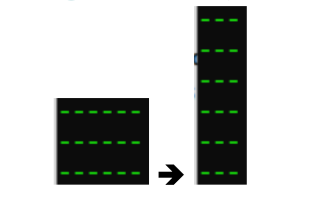
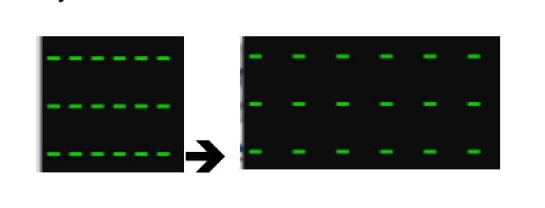
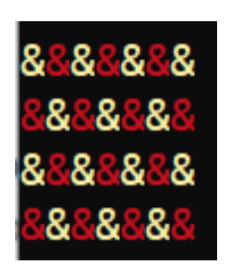

# Assignments of the OOP course - Fall 2021

These assignments provide us a practice exposure and knowledge enhancement of the subjects we learned.

# Assignment 1 
## Description:
A class ColoredBox which stores a box of characters (Dynamic 2D array). 
### Functions:
- display function that prints the box
- displayTransposed that displays the box transposed



-  displayWider that displays the box on a wider scale



- A function that takes a color and displays the box as a chess board



- getArea that returns the calculated area of the box
- static member function getMaxArea that returns the
value of the static member variable. 

# Assignment 2 
Online Shopping System
(practice on operator overloading)
## Description:

Develop a set of functions for an online
shopping system. The system is represented by the following structure:

* Class Item that have : ID, name, quantity, price
    * Operator overloading for the ==, +=,-=, >> and << operators

* Class Seller that have : name, email, items,maxItems

    * To add an item in the sellers items:
        * If the item already exists in the seller's items you will increase the item’s quantity by the quantity of the parameter item using the (+=) in Item class, and the price of the parameter object will be ignored. Use the == operator for this where an item is equal to another if they have the same name.
        * Else the item will be added to the seller’s items.
    * To sell an item: 
        * If the quantity is <= item’s quantity you will decrease it from item Using the (-=) in Item class.
        * Else print for the user the quantity left for this item.
    * To Print Items:
        * print each item using the (<<) operator.
    * To Find an Item by ID:
        * This returns an Item object (or a pointer to Item) with the specified ID if there is an item with such ID. 

# Assignment 3
Practice on Files, Inheritance and Polymorphism

## Description:
There are 5 classes: FloatArray, SortedArray,
FrontArray, PositiveArray & NegativeArray.

* FloatArray: 
    * stores a dynamic array of floats 
    * An add method that adds a float at the end of the array
    * Overloading for the insertion operator << to write the array to a file (ofstream)
    * Overloading for the extraction operator >> to read the array elements from the file (ifstream) and add them to the array
* The SortedArray inherits from FloatArray:
    * An add method that adds a float at the right place in the array such that the array remains sorted with every add 
* The FrontArray inherits from FloatArray:
    * An add method that adds a float at the front of the array
* The PositiveArray that inherits from SortedArray:
    * An add method that adds a float to the array only if it’s a positive number. It then uses the add method of SortedArray.
* The NegativeArray that inherits from SortedArray:
    * An add method that adds a float to the array only if it’s a negative number. It then uses the add method of SortedArray
### The only input to the program is the names of the input txt file and output txt file name

## Sample of the Input file:
```
Sorted 10   8.4 -4 2.3 11 80 7 77 95 12 100
Array 7     3.4 2 0 9 4.7 3 9
Front 5     8 4 7.9 0.44 1
Array 6     45 23 8.5 3.98 4 2.5
Sorted 4    90 6 4 111
Sorted 8    7 3 4 0 1.1 3.2 88 9
Array 6     13.5 7.6 9 33 1 0
Front 3     7 5 1.5
Positive 7  7.9 -1 -44 9.7 4.3 -1 0
Negative 8  88 -1.5 -40 -9.7 4.3 13 0 -11

```
## Sample of the Output file:
```
10|	-4	2.3	7	8.4	11	12	77	80	95	100	
7|	3.4	2	0	9	4.7	3	9	
5|	1	0.44	7.9	4	8	
6|	45	23	8.5	3.98	4	2.5	
4|	4	6	90	111	
8|	0	1.1	3	3.2	4	7	9	88	
6|	13.5	7.6	9	33	1	0	
3|	1.5	5	7	
3|	4.3	7.9	9.7	
4|	-40	-11	-9.7	-1.5	
```
